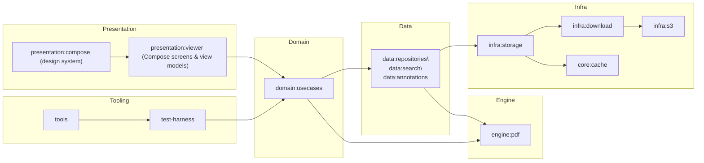

# NovaPDF Reader

NovaPDF Reader is a Jetpack Compose Android application that experiments with "Adaptive Flow Reading" for fluid PDF consumption, annotation, and accessibility enhancements on modern Android devices.

## Architecture overview

NovaPDF Reader follows a modular, clean-architecture layout so presentation code can
iterate quickly without destabilizing low-level rendering, storage, or networking
components. Compose screens consume domain use cases, which in turn depend on
repositories, Pdfium-backed engines, and infrastructure services. Each layer enforces a
clear dependency direction (presentation → domain → data/engine → infra/core) so new
features can live behind stable APIs while native and network integrations evolve
independently.【F:presentation/viewer/src/main/kotlin/com/novapdf/reader/PdfViewerViewModel.kt†L608-L858】【F:domain/usecases/src/main/kotlin/com/novapdf/reader/domain/usecase/PdfViewerUseCases.kt†L47-L200】【F:data/repositories/src/main/kotlin/com/novapdf/reader/data/PdfDocumentRepository.kt†L155-L236】【F:infra/storage/src/main/kotlin/com/novapdf/reader/data/remote/DocumentSourceGateway.kt†L7-L35】

### High-level diagram



### Module responsibilities

| Module | Responsibilities |
| --- | --- |
| `app` | Configures application-wide Gradle automation, including PDFium validation, signing credential resolution, and CI hooks for the Android app packaging pipeline.【F:app/build.gradle.kts†L34-L170】 |
| `presentation:viewer` | Hosts the Compose-based screens, view model orchestration, and render queues that coordinate remote downloads, adaptive flow telemetry, and prioritized page rendering for the reader UI.【F:presentation/viewer/src/main/kotlin/com/novapdf/reader/PdfViewerViewModel.kt†L608-L858】【F:presentation/viewer/src/main/kotlin/com/novapdf/reader/RenderWorkQueue.kt†L15-L197】 |
| `presentation:compose` | Provides theming primitives and accessibility helpers (for example the reusable haptic feedback manager) that power the presentation layer design system.【F:presentation/compose/src/main/kotlin/com/novapdf/reader/accessibility/HapticFeedbackManager.kt†L9-L30】 |
| `domain:model` | Centralizes cross-module data types such as domain error codes and coroutine dispatcher abstractions so tests can swap schedulers deterministically.【F:domain/model/src/main/kotlin/com/novapdf/reader/model/DomainError.kt†L4-L18】【F:domain/model/src/main/kotlin/com/novapdf/reader/coroutines/CoroutineDispatchers.kt†L7-L28】 |
| `domain:usecases` | Aggregates the reader-facing use cases (document lifecycle, rendering, annotations, bookmarks, search, adaptive flow, preferences) that the UI consumes behind a stable API.【F:domain/usecases/src/main/kotlin/com/novapdf/reader/domain/usecase/PdfViewerUseCases.kt†L47-L200】 |
| `data:repositories` | Implements the heavy PDF document repository, caching, and Lucene-backed search coordination, including tight integration with Pdfium and bitmap memory budgeting.【F:data/repositories/src/main/kotlin/com/novapdf/reader/data/PdfDocumentRepository.kt†L155-L236】【F:data/repositories/src/main/kotlin/com/novapdf/reader/search/DocumentSearchCoordinator.kt†L10-L18】 |
| `engine:pdf` | Supplies the adaptive flow manager that tracks frame pacing, sensor input, and preload targets to modulate reading velocity and prefetch strategy.【F:engine/pdf/src/main/kotlin/com/novapdf/reader/DefaultAdaptiveFlowManager.kt†L39-L200】 |
| `infra:storage` | Defines the remote storage gateway, download manager, and error taxonomy for resolving document sources into cached URIs with integrity and safety checks.【F:infra/storage/src/main/kotlin/com/novapdf/reader/data/remote/DocumentSourceGateway.kt†L7-L35】【F:infra/storage/src/main/kotlin/com/novapdf/reader/data/remote/PdfDownloadManager.kt†L22-L118】 |
| `infra:download` | Wraps the storage download manager with retry/backoff semantics tailored for S3-backed PDFs and exposes a simple API to the domain layer.【F:infra/download/src/main/kotlin/com/novapdf/reader/download/RemotePdfDownloader.kt†L14-L86】 |
| `infra:s3` | Provides the production S3 `StorageClient` implementation and Hilt bindings that adapt `s3://` URIs into HTTPS requests via OkHttp.【F:infra/s3/src/main/kotlin/com/novapdf/reader/integration/aws/S3StorageClient.kt†L17-L61】【F:infra/s3/src/main/kotlin/com/novapdf/reader/data/remote/di/S3Module.kt†L19-L35】 |
| `core:cache` | Manages on-device cache roots, eviction budgets, and directory hygiene for documents, thumbnails, tiles, and search indexes.【F:core/cache/src/main/kotlin/com/novapdf/reader/cache/CacheDirectories.kt†L1-L90】 |
| `test-harness` | Generates deterministic stress PDFs and storage fakes that power instrumentation, screenshot, and regression suites without shipping large binary fixtures.【F:test-harness/src/main/kotlin/com/novapdf/reader/ThousandPagePdfWriter.kt†L10-L156】 |
| `tools` | Hosts reproducible automation scripts such as the logcat analyzer that surface ANR/crash signatures during connected test runs.【F:tools/check_logcat_for_crashes.py†L9-L78】 |

### Threading model

NovaPDF leans on Kotlin coroutines with an explicit dispatcher abstraction so background
I/O, Pdfium work, and UI rendering remain isolated yet testable. Key guarantees include:

- Coroutine dispatchers flow through the `CoroutineDispatchers` abstraction so production builds stick to `Dispatchers.IO`, `Dispatchers.Default`, and `Dispatchers.Main` while tests can inject deterministic schedulers.【F:domain/model/src/main/kotlin/com/novapdf/reader/coroutines/CoroutineDispatchers.kt†L7-L28】
- `PdfDocumentRepository` serializes Pdfium work onto a dedicated dispatcher created with `limitedParallelism(1)` to prevent native crashes and coordinate bitmap memory pressure while exposing state via `StateFlow` to the UI.【F:data/repositories/src/main/kotlin/com/novapdf/reader/data/PdfDocumentRepository.kt†L155-L241】
- The presentation layer executes prioritized rendering through `RenderWorkQueue`, which multiplexes visible, nearby, and thumbnail jobs with bounded parallelism and cancellation awareness on the supplied dispatcher.【F:presentation/viewer/src/main/kotlin/com/novapdf/reader/RenderWorkQueue.kt†L15-L197】
- `DefaultAdaptiveFlowManager` runs frame monitoring, sensor sampling, and preload computations on the injected default dispatcher while posting UI callbacks on the main thread, ensuring adaptive flow heuristics never block Compose rendering.【F:engine/pdf/src/main/kotlin/com/novapdf/reader/DefaultAdaptiveFlowManager.kt†L39-L200】

### Error taxonomy

Errors surface with structured metadata so the UI can gracefully degrade rendering and
deliver actionable messaging:

- Remote retrieval failures surface as `RemotePdfException` values that capture the reason (network issues, retries exhausted, corruption, circuit breakers, unsafe content, and oversize files) alongside optional diagnostics for UI messaging.【F:infra/storage/src/main/kotlin/com/novapdf/reader/data/remote/RemotePdfException.kt†L5-L41】
- The repository distinguishes between open-time errors (unsupported URI, denied access, corrupted documents) via `PdfOpenException` and render-time faults (pages that are too large or malformed) via `PdfRenderException` so the domain layer can react precisely.【F:data/repositories/src/main/kotlin/com/novapdf/reader/data/PdfDocumentRepository.kt†L120-L140】
- Domain responses collapse into a small, user-facing `DomainErrorCode` enum (I/O timeouts, malformed PDFs, render out-of-memory) wrapped by `DomainException` for consistent presentation-layer handling.【F:domain/model/src/main/kotlin/com/novapdf/reader/model/DomainError.kt†L4-L18】
- Unsupported or untrusted document sources propagate as `RemotePdfException` instances originating from the delegating document source gateway, ensuring callers receive a structured failure even when no handler can resolve a source.【F:infra/storage/src/main/kotlin/com/novapdf/reader/data/remote/DocumentSourceGateway.kt†L7-L35】

## Testing matrix

| Suite | Command | Primary coverage | Notes |
| --- | --- | --- | --- |
| JVM unit tests | `./gradlew testDebugUnitTest` | View models, repositories, and utility layers using Robolectric and standard unit runners. | Runs quickly on the host and honors the injected coroutine dispatchers for deterministic scheduling.【F:domain/model/src/main/kotlin/com/novapdf/reader/coroutines/CoroutineDispatchers.kt†L7-L28】 |
| Adaptive Flow performance probes | `./gradlew adaptiveFlowPerformance`<br>`./gradlew frameMonitoringPerformance` | Exercises frame pacing heuristics and adaptive flow backpressure logic without launching the full test matrix. | Both tasks reuse the dedicated Robolectric suites for the adaptive flow manager and report regressions immediately.【F:README.md†L104-L113】 |
| Connected instrumentation | `./gradlew connectedAndroidTest` | Full UI automation, remote download flows, and screenshot harness validation on emulators or devices. | Requires API 32+ system images and benefits from the emulator launch arguments below. Logs can be post-processed with `tools/check_logcat_for_crashes.py` to surface ANR or crash signatures.【F:README.md†L121-L166】【F:tools/check_logcat_for_crashes.py†L9-L78】 |
| Macrobenchmark & baseline profile | `./gradlew :baselineprofile:connectedBenchmarkAndroidTest --stacktrace` | Measures cold start, frame pacing, and render performance budgets while guarding the committed baseline profile. | Fails the build if thresholds regress; follow up with `:app:generateReleaseBaselineProfile` to refresh shipped profiles.【F:README.md†L199-L238】 |
| Screenshot harness | `adb shell am instrument …` (see below) | Captures deterministic device-side PNGs with metadata for documentation and regressions. | Also callable through `tools/capture_screenshots.py` for host-side captures and log synchronization.【F:README.md†L176-L197】 |

### Regression documentation

Record any instability you discover in [`docs/regressions`](docs/regressions) so the
team can reproduce and verify fixes quickly. The [regression playbook](docs/regressions/README.md)
explains when to file a note, which sections to include, and provides a ready-to-copy
template that matches our existing Pdfium crash write-up.【F:docs/regressions/README.md†L1-L87】

## Adaptive Flow performance tooling

Adaptive Flow now records frame pacing through `Choreographer` on the main thread so that preloading logic can back off when the UI is under pressure. Two dedicated Gradle tasks are available to exercise the timing heuristics and frame monitoring in isolation:

```
./gradlew adaptiveFlowPerformance
./gradlew frameMonitoringPerformance
```

Both tasks reuse the Robolectric unit tests backing the Adaptive Flow manager and give fast feedback without running the full unit test suite.

## Fallback modes

The reader automatically downgrades risky subsystems when repeated crashes or
resource failures trip its safety guards. The [fallback mode
reference](docs/fallback-modes.md) documents every recovery path, the
conditions that enable it, how to reproduce each one manually, and the
user-visible breadcrumbs/snackbars that confirm the fallback is active.

## Sample PDF fixture

Automated tests and screenshot generation rely on a tiny CC0 1.0 licensed document that now ships inline with the instrumentation test sources. The encoded fixture is decoded directly into the device cache before opening it in the viewer so rendering can be validated without relying on external network services or bundling binary blobs in git.

See `docs/sample-pdf-license.md` for the redistribution notice covering the bundled document.

## Running connected Android tests locally

Instrumentation and macrobenchmark tests require an Android SDK installation that includes
the `platform-tools`, `build-tools`, and emulator components for API level 32.

1. Install the Android command-line tools and use `sdkmanager` to download the required
   packages:

   ```bash
  sdkmanager "platform-tools" "build-tools;34.0.0" "platforms;android-32" "emulator"
   ```

2. Point Gradle to your SDK installation by setting `ANDROID_SDK_ROOT`/`ANDROID_HOME` or by
   adding an `sdk.dir=/absolute/path/to/sdk` entry to `local.properties`.

3. Ensure that a device or emulator is available before invoking:

   ```bash
   ./gradlew connectedAndroidTest
   ```

### Emulator launch arguments

For reliable UI tests, start the Android emulator with snapshots disabled and
ample memory/storage to reduce hangs during heavy PDF rendering. Provision the
virtual device with at least 6 GB of RAM (8 GB preferred) and an 8 GB writable data partition, and
ensure hardware acceleration (KVM/HAXM/Hypervisor) is available so the
instrumentation run has full CPU access. Prefer the software SwiftShader GPU
(`-gpu swiftshader_indirect`) unless you have confirmed a dedicated GPU is
stable under load. The readiness checks now require a cold boot (`-no-snapshot-load -wipe-data`) on every
launch and insist on SwiftShader unless you explicitly opt in to hardware GPU
mode and confirm KVM safety. Set `NOVAPDF_ALLOW_HARDWARE_GPU=1` together with
`NOVAPDF_EMULATOR_KVM_CONFIRMED_SAFE=1` (or run on a host that exposes a
read/write `/dev/kvm`) to bypass the SwiftShader guardrail.
Always wipe user data and cold boot the emulator before
invocation so no residue from earlier runs remains (set
`NOVAPDF_EMULATOR_ENFORCE_SNAPSHOT_FLAGS=0` to disable this enforcement for local debugging):

```bash
emulator @NovaPDFApi32 \
    -no-snapshot-save \
    -no-snapshot-load \
    -wipe-data \
    -no-boot-anim \
    -accel on \
    -memory 8192 \
    -partition-size 8192 \
    -gpu swiftshader_indirect
```

Use `-accel off` if the host machine does not support KVM acceleration.

When no device is present, the build gracefully skips connected tests while still verifying
that the project compiles.

NovaPDF's Gradle automation also issues `adb shell cmd appops set com.google.android.gms REQUEST_INSTALL_PACKAGES ignore` and
`UPDATE_PACKAGES_WITHOUT_USER_ACTION ignore` so Play Services cannot trigger auto-updates on the
shared test images. This keeps background download storms from starving instrumentation
runs; ensure your custom emulator snapshots expose the `cmd appops` utility so the
suppression can be applied automatically.

## Amazon S3 integration

- Remote documents can be referenced with `s3://bucket/key.pdf` URIs; the injected `S3StorageClient` validates the scheme, extracts the bucket/key, and performs the download via OkHttp before streaming the response back to the caller.【F:infra/s3/src/main/kotlin/com/novapdf/reader/integration/aws/S3StorageClient.kt†L17-L56】
- Hilt wiring in `infra:s3` binds the S3 client as the active `StorageClient` and provisions a `PdfDownloadManager`, so including the module in your app dependency graph enables S3-backed downloads automatically.【F:infra/s3/src/main/kotlin/com/novapdf/reader/data/remote/di/S3Module.kt†L19-L35】
- The `S3RemotePdfDownloader` composes exponential backoff and retry semantics on top of the download manager, emitting structured `RemotePdfException` failures when the remote object is unreachable or unsafe; callers can opt in to large files when the UI gains user consent.【F:infra/download/src/main/kotlin/com/novapdf/reader/download/RemotePdfDownloader.kt†L14-L86】
- Ensure your buckets serve either public objects or pre-signed URLs over HTTPS. Authenticated downloads require producing a signed `s3://` URI that maps to an HTTP 200 response for the constructed `https://bucket.s3.amazonaws.com/key` request; otherwise the client surfaces an `IOException` with the failing status code.【F:infra/s3/src/main/kotlin/com/novapdf/reader/integration/aws/S3StorageClient.kt†L26-L44】
- For local testing, you can point the downloader at mock S3-compatible endpoints (for example LocalStack) by overriding the injected `OkHttpClient` configuration or substituting a fake `StorageClient` in Hilt tests, mirroring how the test harness provides deterministic storage fakes.【F:test-harness/src/main/kotlin/com/novapdf/reader/storage/TestStorageClients.kt†L1-L85】

## Programmatic screenshot capture

The screenshot harness can capture UI frames directly on the device when invoked with
```
adb shell am instrument -w -r \
    -e runScreenshotHarness true \
    -e captureProgrammaticScreenshots true \
    -e testPackageName com.novapdf.reader.test \
    -e class com.novapdf.reader.ScreenshotHarnessTest#openThousandPageDocumentForScreenshots \
    com.novapdf.reader.test/dagger.hilt.android.testing.HiltTestRunner
```

When the `captureProgrammaticScreenshots` argument is `true`, the harness saves a PNG in the
instrumentation cache directory and temporarily adopts the
`FOREGROUND_SERVICE_MEDIA_PROJECTION` permission so the process only opts into the
`mediaProjection` foreground service type while the screenshot is recorded.

For host-side captures, run `tools/capture_screenshots.py`. Install the debug and androidTest APKs
on the target device once before invoking the script. Provide the harness test package explicitly
either via `--test-package com.novapdf.reader.test`, by exporting the
`NOVAPDF_SCREENSHOT_TEST_PACKAGE` environment variable, or by editing
`config/screenshot-harness.env` so the script can resolve the instrumentation application reliably:

```
./gradlew :app:installDebug :app:installDebugAndroidTest
```

The script launches the harness, waits for the ready handshake flags, and records a PNG via
`adb exec-out screencap -p`. The output filenames follow the `<docId>_pageNNNN.png` convention
using the sanitized document ID and the one-based page number reported by the harness. The ready
flag payload now includes JSON metadata describing the document ID, sanitized identifier, page
index, and total page count so downstream tooling can reason about the captured frame
deterministically.

### Stabilising heavy PDF screenshot runs

`tools/capture_screenshots_ci.sh` now clears the harness cache directories before each launch and
automatically retries once when the readiness flag fails to materialise, which keeps stale
thousand-page fixtures from blocking subsequent attempts. The script also honours the following
environment variables so especially slow devices can expand the waiting windows without modifying
the wrapper:

| Variable | Description |
| --- | --- |
| `NOVAPDF_ACTIVITY_MANAGER_TIMEOUT` / `NOVAPDF_ACTIVITY_MANAGER_TIMEOUT_SCALE` | Override or scale the Activity Manager warm-up timeout (defaults to the dynamic snapshot heuristics). |
| `NOVAPDF_HARNESS_READY_TIMEOUT` / `NOVAPDF_HARNESS_READY_TIMEOUT_SCALE` | Override or scale how long the harness waits for the screenshot readiness flag. |
| `NOVAPDF_HARNESS_READY_RETRIES` | Number of additional attempts to make after a readiness timeout (default `1`). |

### Running the harness on Firebase Test Lab

Physical devices in Firebase Test Lab avoid local virtualization limits when capturing the
thousand-page stress document. The `tools/firebase_run_screenshot_harness.sh` helper wraps the
`gcloud firebase test android run` invocation with sane defaults for the harness class, environment
variables, and directories to pull so you only supply the APKs:

```bash
./gradlew :app:assembleDebug :app:assembleDebugAndroidTest
tools/firebase_run_screenshot_harness.sh \
    --app app/build/outputs/apk/debug/app-debug.apk \
    --test app/build/outputs/apk/androidTest/debug/app-debug-androidTest.apk \
    --device model=panther,version=34
```

Pass `--dry-run` to inspect the underlying `gcloud` command or add repeated `--environment` flags to
propagate extra instrumentation arguments.

## Baseline profile generation and macrobenchmarks

NovaPDF ships a baseline profile so cold starts and the initial render of large documents
benefit from ahead-of-time compilation. The profile lives at
`app/src/main/baseline-prof.txt` and is regenerated from the Macrobenchmark test suite in
the `baselineprofile` module.

1. Boot a physical device or emulator running API 32+ with hardware acceleration enabled.
   Always rerun baseline and macrobenchmark jobs on the exact same
   hardware profile and system image (API level, RAM, and CPU) so
   performance comparisons remain deterministic.
2. Install the debug build once so shared test fixtures are staged:

   ```bash
   ./gradlew :app:assembleDebug :app:assembleDebugAndroidTest
   ```

3. Execute the macrobench regressions to enforce the current performance budgets:

   ```bash
   ./gradlew :baselineprofile:connectedBenchmarkAndroidTest --stacktrace
   ```

   The run fails if cold-start, frame pacing, or render times regress beyond the thresholds
   encoded in `RegressionBenchmark`.

4. Generate a fresh baseline profile and copy it into the application module:

   ```bash
   ./gradlew :app:generateReleaseBaselineProfile --stacktrace
   cp "$(find app/build -type f -iname 'baseline-prof.txt' -path '*/release/*' -print -quit)" \
     app/src/main/baseline-prof.txt
   ```

5. Review the diff and commit the updated file together with any performance-sensitive
   code changes:

   ```bash
   git diff -- app/src/main/baseline-prof.txt
   ```

To avoid forgetting this step, install the provided Git pre-commit hook once per clone:

```bash
git config core.hooksPath tools/git-hooks
```

The hook inspects staged changes and blocks commits that touch performance-sensitive
code (Gradle configuration, source files under `src/main`, and other critical source
types) without also staging the updated `app/src/main/baseline-prof.txt`. When it
triggers, regenerate the profile, stage the file, and re-run the commit.

The CI workflow repeats these steps on a matrix device and fails the build if the generated
profile diverges from the committed snapshot, preventing stale artefacts from shipping. Pull
requests also receive an automated warning (both as workflow annotations and a sticky bot
comment) when they modify performance-sensitive code without refreshing
`app/src/main/baseline-prof.txt`. The reminder highlights the files that triggered the check
and reiterates the need for macrobenchmark coverage of real user journeys so the regenerated
profile reflects the updated execution paths, making it harder to forget the regeneration step.

Recent macrobenchmark results and the generated baseline profile snapshot are captured under
`docs/performance/baselineprofile/runs`. Execute

```bash
python3 tools/scripts/retire_performance_results.py
```

after landing fresh artefacts to enforce the 90-day retention window and keep the repository's
documentation representative of current builds.

## CI validation for heavy PDF workloads

Continuous integration now provisions a synthetic stress PDF with 32 pages that mix large,
panoramic, and extreme aspect ratios to exercise Pdfium rendering paths. Instrumentation
tests open portrait, landscape, tall infographic, and ultra-wide panorama variants of the
document and drive a thousand-page fixture through the UI to ensure the viewer can handle
atypical source material. The workflow invokes `connectedAndroidTest` with
`--rerun-tasks --no-build-cache` so the heavy document scenarios always execute on every
matrix device instead of being satisfied from prior outputs. It fails fast if logcat
reports an Application Not Responding dialog, fatal Java exception, fatal signal, or forced
process restart for `com.novapdf.reader`. It also verifies that both the
`LargePdfInstrumentedTest.openLargeAndUnusualDocumentWithoutAnrOrCrash` and
`PdfViewerUiAutomatorTest.loadsThousandPageDocumentAndActivatesAdaptiveFlow` cases ran
without being skipped so regressions cannot silently avoid the heavy document coverage. To
reproduce the checks locally, run `./gradlew connectedAndroidTest` on an emulator or device
and inspect `adb logcat` for `ANR in com.novapdf.reader` or fatal exception entries.
The helper script `tools/check_logcat_for_crashes.py` mirrors the CI check and can be
run locally with captured logcat or bugreport dumps to confirm that no ANR or crash
signatures were recorded:

```bash
adb logcat -d > logcat-after-tests.txt
tools/check_logcat_for_crashes.py
```

Pass different log or bugreport paths (compressed archives are supported) or a
custom package name if needed:

```bash
tools/check_logcat_for_crashes.py path/to/log.txt --package com.example.app
```

## CI runner maintenance

Stable CI throughput depends on proactively maintaining the runner fleet.

* Apply OS, emulator, and virtualization updates on a regular cadence so new jobs inherit
  the latest fixes. Nodes that lag behind the rest of the fleet add avoidable latency to
  Gradle configuration and instrumentation start-up, so favour rebuilding outdated images
  instead of patching them piecemeal.
* Investigate runners that repeatedly trigger the emulator watchdog or stall during boot;
  the `tools/emulator_watchdog.sh` probe emits structured errors after a configurable period
  of failed health checks, making it easy to spot machines that need to be recycled.
  Retire or reprovision any host that accumulates these alerts instead of letting flakiness
  accumulate in the queue.
* Before opening the queue, run the screenshot harness health check so instrumentation
  dependencies are verified on real hardware. The screenshot tooling embeds a
  `HarnessHealthcheckTest` and automatically executes it whenever a capture attempt times out,
  which surfaces misconfigured or unhealthy devices early.
* When a job stops making progress (no log output, Gradle stuck in `IDLE`, emulator never boots),
  reboot the affected runner immediately and re-run the health check. Persistent offenders should
  be rebuilt or removed from rotation so they do not soak up capacity.
* Use `tools/device_fleet_health.py` to orchestrate the screenshot harness health check across
  every connected device or emulator. The script captures instrumentation phase/testpoint metrics
  alongside CPU, memory, and hardware properties so repeated failures can be correlated with
  specific models or hosts. Invoke it with `--output-json fleet-health.json` inside maintenance
  windows to archive instability trends over time.

## Android cache compatibility

Android 9 (API 28) and higher restrict access to `Thread.threadLocalRandomProbe`, a hidden
runtime API that Caffeine depends on for its concurrent cache implementation. Starting with
Android 12L/13 (API 32) the method is completely blocked which causes an immediate crash as
soon as Caffeine tries to initialize. NovaPDF therefore no longer ships Caffeine on any
runtime target. The bitmap/page cache now relies on `androidx.collection.LruCache`, which is safe on
all supported API levels and runs on a lightweight `Mutex` to guarantee thread-safety.

If you need eviction or expiry semantics beyond the built-in LRU behaviour, prefer layering
those policies on top of `LruCache` or storing metadata in Room/SQLite. Before adding any new
third-party cache library, verify that it is explicitly supported on API 30/32/34 and does not
depend on non-SDK interfaces. The CI pipeline contains a regression check that fails the build
if the `com.github.benmanes.caffeine` package resurfaces in the dependency graph so this
regression cannot silently return.

## Gradle wrapper bootstrap

Binary assets such as the `gradle-wrapper.jar` are intentionally not stored in this repository. Instead, the wrapper JAR is stored as a Base64 text file at `gradle/wrapper/gradle-wrapper.jar.base64`. The included `gradlew` and `gradlew.bat` scripts automatically decode this archive to `gradle/wrapper/gradle-wrapper.jar` (Gradle 8.5) the first time you run them.

If your environment blocks execution of Python, PowerShell, or the `base64` utility, manually decode the file or download the wrapper from `https://services.gradle.org/distributions/gradle-8.5-bin.zip` and copy `gradle-8.5/lib/plugins/gradle-wrapper-8.5.jar` to `gradle/wrapper/gradle-wrapper.jar` before invoking Gradle.
